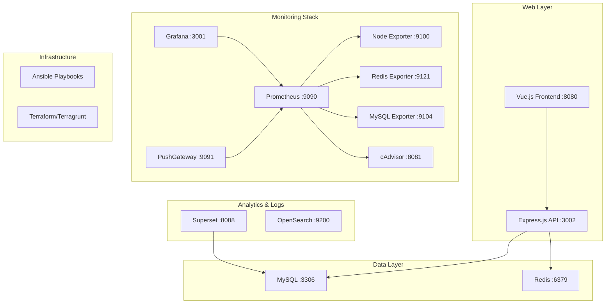

# 🚀 DevOps Learning Environment

<div align="center">


**A complete, production-ready DevOps monitoring and development environment running on Docker Compose**

*Perfect for learning DevOps practices, monitoring, and full-stack development*

</div>

---

## 🌟 Overview

This project provides a **comprehensive local development environment** that mirrors production DevOps setups. It includes modern monitoring stack, databases, web applications, and infrastructure automation tools - all orchestrated with Docker Compose for easy setup and management.

### 🎯 What Makes This Special?

- **� Production-Ready Monitoring**: Complete observability stack with Grafana, Prometheus, and real-time dashboards
- **⚡ Full-Stack Application**: Vue.js frontend with Express.js backend and JWT authentication
- **📊 Data Analytics**: Apache Superset for business intelligence and data visualization
- **🛠️ Infrastructure as Code**: Ansible playbooks and Terraform configurations included
- **🔍 Log Management**: OpenSearch for centralized logging and search capabilities
- **📈 Real-Time Metrics**: Custom metrics collection for application and system monitoring

## 🏗️ Architecture



## 🚀 Features

### 📊 **Monitoring & Observability**
- **Grafana** (port 3001) - Professional dashboards with real-time metrics
- **Prometheus** (port 9090) - Metrics collection and time-series database  
- **AlertManager** (port 9093) - Intelligent alerting and notifications
- **Node Exporter** (port 9100) - System and hardware metrics
- **cAdvisor** (port 8081) - Container resource monitoring
- **Custom Exporters** - MySQL, Redis, and application-specific metrics

### 🗃️ **Data Management**
- **MySQL 8.0** (port 3306) - Primary relational database with health monitoring
- **Redis** (port 6379) - High-performance caching and session storage
- **OpenSearch** (port 9200) - Distributed search and analytics engine

### 🌐 **Web Applications**
- **Vue.js Frontend** (port 8080) - Modern SPA with Sakai UI framework
- **Express.js API** (port 3002) - RESTful backend with Sequelize ORM
- **JWT Authentication** - Secure user authentication system
- **Apache Superset** (port 8088) - Business intelligence and data visualization

### 🛠️ **DevOps & Infrastructure**
- **Infrastructure as Code** - Ansible playbooks for automation
- **Container Orchestration** - Docker Compose with health checks
- **Environment Management** - Configurable via environment variables
- **Monitoring Scripts** - Automated setup and maintenance tools

## 📋 Prerequisites

- **Docker** & **Docker Compose** (v2.x)
- **Git** for version control
- **macOS/Linux** environment (tested on macOS)
- **Available ports**: 3001, 3002, 3306, 6379, 8080, 8088, 9090-9094, 9100, 9104, 9121, 9200

## ⚡ Quick Start

### 1️⃣ Clone & Setup
```bash
git clone https://github.com/yourusername/devops-learning-environment.git
cd devops-learning-environment

# Copy environment configuration
cp .env.example .env
```

### 2️⃣ Launch All Services
```bash
# Start the complete environment
docker compose up -d

# Verify all services are running
docker compose ps
```

### 3️⃣ Setup Monitoring (Essential Step)
```bash
# Initialize monitoring stack
chmod +x push-opensearch-metrics.sh
chmod +x opensearch-metrics-daemon.sh

# Start OpenSearch metrics daemon
nohup ./opensearch-metrics-daemon.sh > opensearch-metrics.log 2>&1 &
```

### 4️⃣ Access Your Environment

| Service | URL | Credentials | Purpose |
|---------|-----|-------------|---------|
| 🎛️ **Grafana Dashboard** | [localhost:3001](http://localhost:3001) | `admin/admin` | **Main monitoring hub** |
| 🌐 **Vue.js Application** | [localhost:8080](http://localhost:8080) | - | Frontend application |
| 📊 **Apache Superset** | [localhost:8088](http://localhost:8088) | `admin/admin` | Business intelligence |
| 🔍 **Prometheus** | [localhost:9090](http://localhost:9090) | - | Metrics & targets |
| 📈 **Express.js API** | [localhost:3002](http://localhost:3002) | - | Backend API + metrics |

## 📊 Monitoring Dashboard

Our **Grafana dashboard** provides comprehensive monitoring with:

- ✅ **Service Status Monitoring** - Real-time UP/DOWN status for all services
- 📈 **System Metrics** - CPU, Memory, Network, and Disk usage
- 🔧 **Application Metrics** - API response times, request rates, error rates
- 🐳 **Container Monitoring** - Docker container resource usage
- 📊 **Database Health** - MySQL connections, query performance, Redis metrics

**🎯 Quick Access**: http://localhost:3001/d/devops-monitoring-fixed/devops-monitoring-fixed

## �️ Project Structure

```
devops-learning-environment/
├── 📁 docker-compose.yml              # Main orchestration file
├── 📁 .env                            # Environment configuration  
├── 📁 monitoring/                     # Monitoring configurations
│   ├── prometheus/prometheus.yml      # Metrics collection config
│   └── alert_rules.yml               # Alerting rules
├── 📁 grafana/                        # Grafana setup
│   ├── dashboards/                    # Pre-built dashboards
│   └── provisioning/                  # Auto-configuration
├── 📁 testing-web-server/             # Express.js backend
│   ├── controllers/                   # API controllers
│   ├── models/                        # Database models
│   └── middleware/                    # Custom middleware
├── 📁 testing-web-client/             # Vue.js frontend  
│   ├── src/components/                # Vue components
│   └── src/views/                     # Application views
├── 📁 mysql/                          # Database initialization
├── 📁 opensearch/                     # Search engine config
├── 📁 superset/                       # BI tool configuration
├── 📁 ansible/                        # Infrastructure automation
├── 📁 terraform/                      # Infrastructure as Code
├── 📁 scripts/                        # Utility scripts
└── 📁 docs/                           # Comprehensive documentation
```

## 🛠️ Available Scripts

### Core Operations
```bash
# Complete environment lifecycle
docker compose up -d              # Start all services
docker compose down               # Stop all services  
docker compose down -v            # Stop and remove volumes
docker compose ps                 # Check service status
```

### Monitoring Management
```bash
# OpenSearch metrics (required for dashboard)
./push-opensearch-metrics.sh                    # Manual metrics push
./opensearch-metrics-daemon.sh                  # Auto-update daemon

# Prometheus management
curl -X POST http://localhost:9090/-/reload     # Reload configuration
```

### Development Utilities
```bash
# Database operations
docker exec devops_mysql mysql -u root -proot   # MySQL CLI access
docker exec devops_redis redis-cli              # Redis CLI access

# Log monitoring
docker logs devops_grafana                      # Grafana logs
docker logs devops_prometheus                   # Prometheus logs
```

## 🔧 Configuration

### Environment Variables (.env)
```bash
# Ports Configuration
GRAFANA_PORT=3001
PROMETHEUS_PORT=9090
EXPRESS_PORT=3002
VUE_APP_PORT=8080

# Database Configuration  
MYSQL_ROOT_PASSWORD=root
MYSQL_DATABASE=devops_app
REDIS_PASSWORD=redis_password

# Monitoring Configuration
OPENSEARCH_MEMORY=1g
DISCOVERY_TYPE=single-node
```

### Custom Metrics Collection

The environment includes custom metrics for comprehensive monitoring:

- **Application Metrics**: API response times, request rates, error rates
- **Business Metrics**: User registrations, active sessions, feature usage  
- **Infrastructure Metrics**: Custom health checks and service dependencies

## 🎯 Use Cases

### 🏫 **Learning & Education**
- **DevOps Practices**: Learn monitoring, logging, and observability
- **Full-Stack Development**: Practice with modern web technologies
- **Infrastructure Management**: Experiment with Docker, databases, and services

### 💼 **Professional Development**  
- **Portfolio Projects**: Demonstrate monitoring and infrastructure skills
- **POC Development**: Rapid prototyping with production-like environment
- **Interview Preparation**: Hands-on experience with industry tools

### 🔬 **Experimentation**
- **Technology Evaluation**: Test new tools and integrations
- **Performance Testing**: Monitor application behavior under load
- **Architecture Design**: Design and test distributed system patterns

## 📚 Advanced Features

### 🔍 **Health Checks & Monitoring**
All services include comprehensive health checks and monitoring:

```yaml
healthcheck:
  test: ["CMD", "curl", "-f", "http://localhost:3001/api/health"]
  interval: 30s
  timeout: 10s
  retries: 3
  start_period: 40s
```

### 📊 **Custom Dashboards**
Pre-configured Grafana dashboards include:

- **DevOps Overview**: High-level service status and system health
- **Application Performance**: API metrics, response times, throughput
- **Infrastructure Monitoring**: System resources, container metrics
- **Database Analytics**: MySQL and Redis performance metrics

### � **Security Features**
- JWT-based authentication with bcrypt password hashing
- Secure container networking with isolated networks
- Environment-based configuration management
- Health check endpoints for service monitoring

## 🐛 Troubleshooting

### Common Issues

**Services won't start?**
```bash
# Check port availability
netstat -an | grep LISTEN | grep -E "(3001|3002|9090)"

# Restart with fresh containers  
docker compose down -v && docker compose up -d
```

**Monitoring dashboard shows "No Data"?**
```bash
# Verify Prometheus targets
curl http://localhost:9090/api/v1/targets

# Restart OpenSearch metrics daemon
pkill -f opensearch-metrics-daemon
nohup ./opensearch-metrics-daemon.sh > opensearch-metrics.log 2>&1 &
```

**Database connection issues?**
```bash
# Check MySQL status
docker exec devops_mysql mysqladmin -u root -proot ping

# Reset MySQL data
docker compose stop mysql && docker volume rm devops-learning_mysql_data
```


